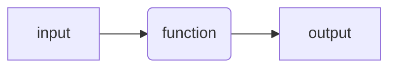
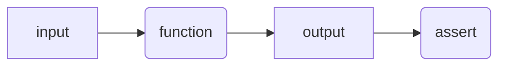
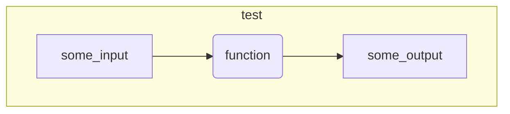
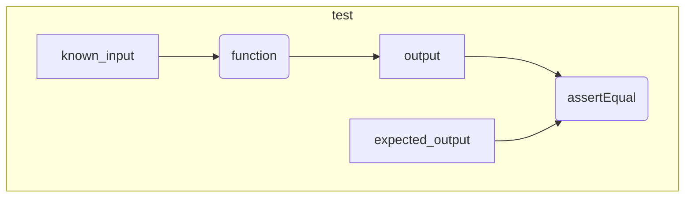

# Testing

<!--
!!! quote ""

    Untested code is broken code.
-->



- [x] create a function

```matlab

```

<!--
Code without tests is code that you are afraid to change.

Code without tests is code with undefined behavior.
-->

## Using `assert`

<!--
!!! quote ""

    Some testing is better then no testing
-->



- [x] use `assert` inside the function to check some aspect
      of the behavior of the function

```matlab

```


## Smoke test



- [x] create a "smoke" test by writing a function that:
    - [x] calls the function with some input

```matlab

```

## Unit test



- [x] create a unit test by writing a function that:
    - [x] calls the function with a specific input
    - [x] asserts that that the output is as expected

```matlab

```

- [x] test the function with a variety of inputs

### Other example

#### `plot_line`

```matlab

```

```matlab

```

## Using a testing framework

- [x] rewrite the unit test so that it can be run
      with MOxUnit or MATLAB testing framework

### With MoxUnit

```matlab

```

```matlab
success = moxunit_runtests(test_folder, ...
                           '-verbose', ...
                           '-recursive', ...
                           '-cover', source_cover)
```

### Other example

#### `create_participant_file`

```matlab

```

```matlab

```

### With MATLAB

```matlab

```

## Code coverage

- [x] write a script to use MoxUnit to run all the tests
      and generate a code coverage report

```matlab

```

## Testing "legacy" code

- [x] create a new repository and add the `code` and `data` folder in it
- [x] add tests that should check that the functions in `code` :
    - [x] create figures
    - [x] save data that is "equivalent" to the one already present in the `data` folder,

```matlab

```

- [x] get a code coverage report for the tests

```matlab

```


<!--
## F.I.R.S.T.

Test should be:

- Fast
- Independent
- Repeatable
- Self-validating
- Timely
-->

## References

See the [references](../references.md#testing-and-refactoring) page for more information.
