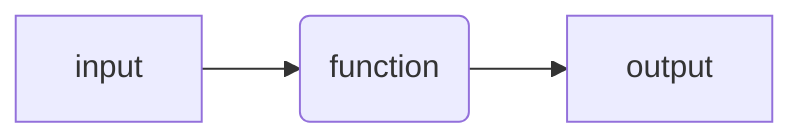
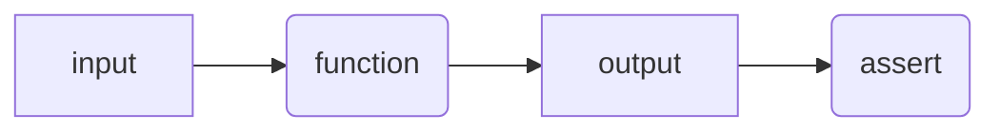
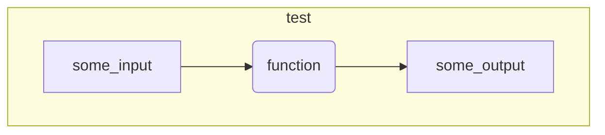
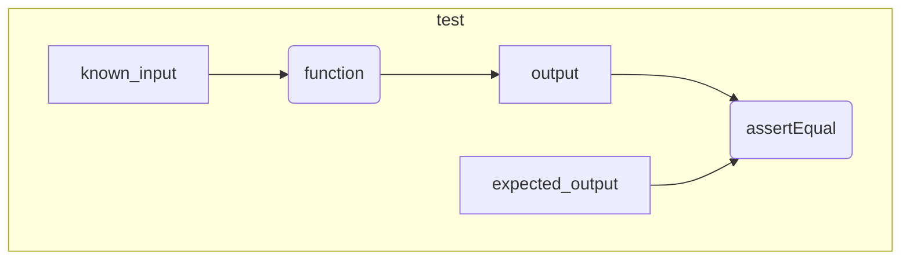

# Testing

!!! quote ""
    
    Untested code is broken code.




```matlab

```

## Using `assert`

!!! quote ""
    
    Some testing is better then no testing



```matlab

```

## Smoke test



```matlab

```

## Unit test




```matlab

```

## Using a testing framework

## Code coverage

## Adding test to your code

## References

See the [references](../references.md#testing-and-refactoring) page for more information.