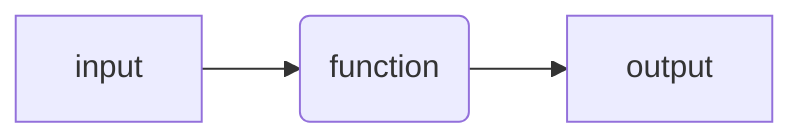
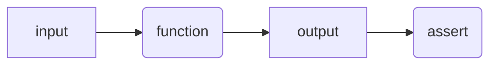
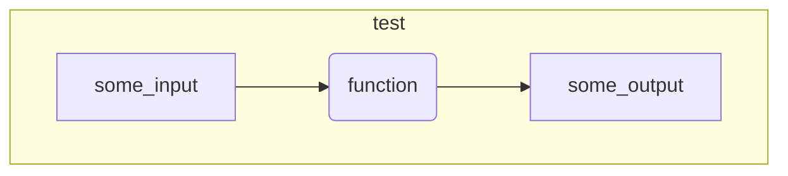
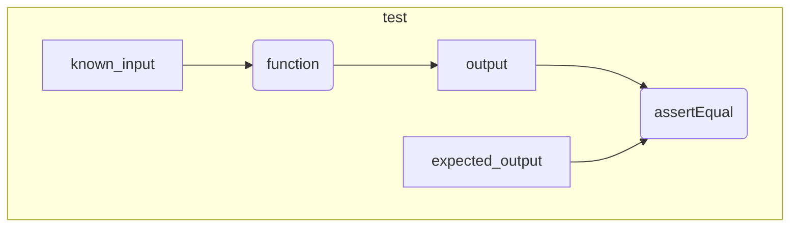

# Testing

<!-- 
!!! quote ""
    
    Untested code is broken code.
-->




<!-- 
```matlab

```
Code without tests is code that you are afraid to change.

Code without tests is code with undefined behavior. 
-->

## Using `assert`

<!-- 
!!! quote ""
    
    Some testing is better then no testing
-->



<!--
```matlab

```
-->

## Smoke test



<!--
```matlab

```
-->

## Unit test


<!-- 
```matlab

```
-->

## Using a testing framework

### With MoxUnit

<!--
```matlab

```

```matlab
success = moxunit_runtests(test_folder, ...
                           '-verbose', ...
                           '-recursive', ...
                           '-cover', source_cover)
```
-->

### With MATLAB

<!--
```matlab

```
-->

## Code coverage

<!--
```matlab
success = moxunit_runtests(testFolder, ...
                           '-verbose', ...
                           '-recursive', ...
                           '-with_coverage', ...
                           '-cover', folderToCover, ...
                           '-cover_html_dir', fullfile(pwd, 'coverage_html'));
```
-->

## Testing "legacy" code

<!-- 
## F.I.R.S.T.

Test should be:

- Fast
- Independent
- Repeatable
- Self-validating
- Timely
-->

## References

See the [references](../references.md#testing-and-refactoring) page for more information.