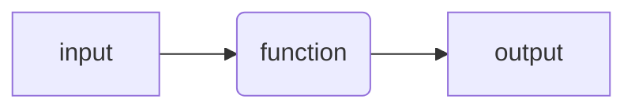
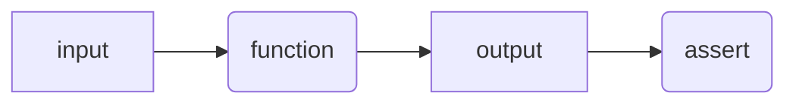
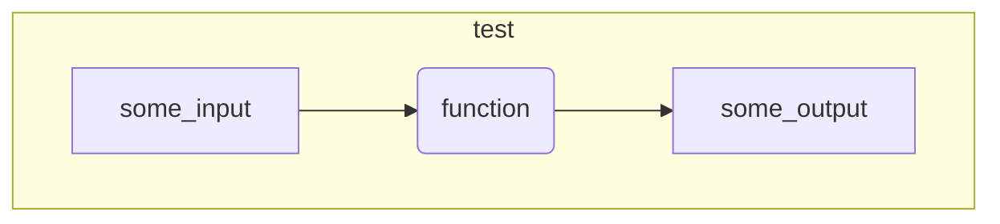
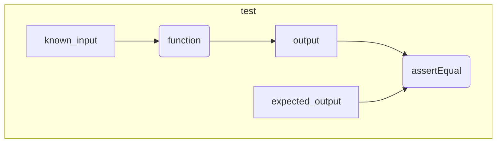

# Testing

<!-- 
!!! quote ""
    
    Untested code is broken code.
-->




[ ] create a function

<!-- 
```matlab

```
Code without tests is code that you are afraid to change.

Code without tests is code with undefined behavior. 
-->

## Using `assert`

<!-- 
!!! quote ""
    
    Some testing is better then no testing
-->



[ ] use `assert` inside the function to check some aspect 
    of the behavior of the function

<!--
```matlab

```
-->

## Smoke test



[ ] create a "smoke" test by writing a function 
    that calls the function with some input

<!--
```matlab

```
-->

## Unit test



[ ] create a unit test by writing a function that calls the function 
    with a specific input and assert that that the output is as expected

<!-- 
```matlab

```
-->

[ ] test the function with a variety of inputs

## Using a testing framework

[ ] rewrite the unit test so that it can be run 
    with MOxUnit or MATLAB testing framework

### With MoxUnit

<!--
```matlab

```

```matlab
success = moxunit_runtests(test_folder, ...
                           '-verbose', ...
                           '-recursive', ...
                           '-cover', source_cover)
```
-->

### With MATLAB

<!--
```matlab

```
-->

## Code coverage

[ ] write a script to use MoxUnit to run all the tests 
    and generate a code coverage report

<!--
```matlab
success = moxunit_runtests(testFolder, ...
                           '-verbose', ...
                           '-recursive', ...
                           '-with_coverage', ...
                           '-cover', folderToCover, ...
                           '-cover_html_dir', fullfile(pwd, 'coverage_html'));
```
-->

## Testing "legacy" code


- [ ] create a new repository and add the `code` and `data` folder in it
- [ ] add tests for the functions in `code`
      The test should check that the data saved by each function
      is "equivalent" to the one already present in the `data` folder.


<!-- 
## F.I.R.S.T.

Test should be:

- Fast
- Independent
- Repeatable
- Self-validating
- Timely
-->

## References

See the [references](../references.md#testing-and-refactoring) page for more information.